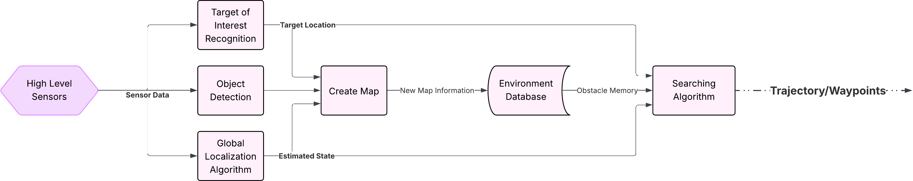

# ARES Guidance and Coordination Package

This package provides the guidance-level coordination nodes for the ARES rover system. It coordinates when the rover should plan, execute a path, stop, or switch behavior during autonomous exploration and target searching.

The package acts as the middle layer between the searching/planning service and the path-tracking controller. It requests paths from the planner, sends paths to the path-tracking package for execution, and manages the rover behavior based on the current mission state.

## Required Packages

* `path_tracking`: Tracks the planned path and sends motion commands to the STM32.
* `searching_and_planning`: Provides the searching and path-planning service.
* Rover position provider: Provides the current rover pose. This can come from a real localization system or a simulated position source.
* Target point provider: Provides the detected target position. This can be a real target detection node or a simulated target provider.

If no target point provider is available, the rover will continue exploring the environment without navigating to a specific target.

## System Overview with Real Rover

The figure below shows the guidance and coordination flow chart for a real rover setup:

## System Behavior

When the target has not been found, the rover explores the environment according to the exploration strategy provided by the `searching_and_planning` package.

When the target is found, the guidance node requests a path to the target from the planner every 5 seconds. If a valid path is returned, the path is sent to the `path_tracking` package for execution. At the same time, the other rovers are commanded to stop so that only the selected rover approaches the target.

If no valid path to the target is found, the rover continues exploring until a feasible path can be planned.
