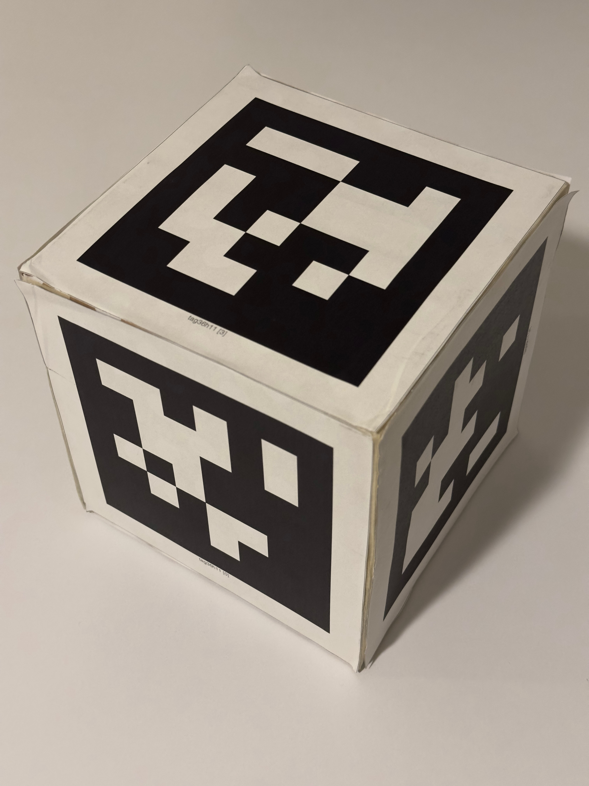

# ARES Target Recognition Using AprilTags

This package provides AprilTag-based target recognition for the ARES rover system. It detects the AprilTag target using a camera and publishes the estimated 2D position of the tag when the target is found.

The target used in this project is a 15 cm × 15 cm AprilTag.

## Calibration

TBD: Add camera calibration instructions here.

Camera calibration is required so that the tag position can be estimated accurately from the camera image.

## Usage

Use the launch file to start the target recognition nodes. When the AprilTag is detected, the package publishes the target position on `/target_location`. The published target position is given in the global frame.
