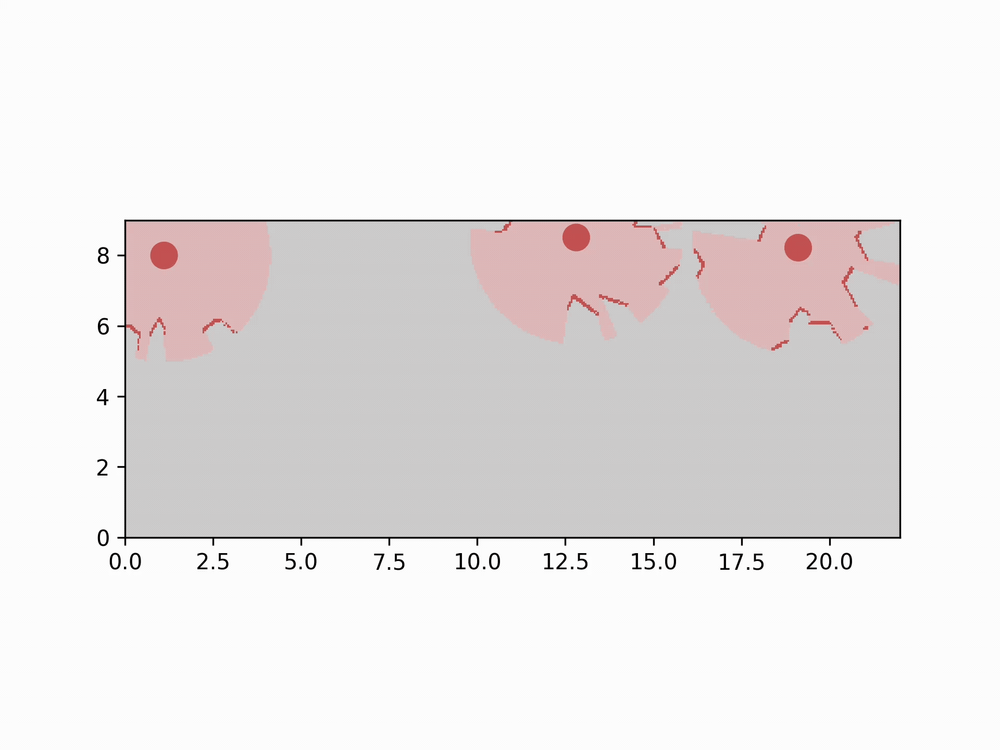

# ARES Searching and Planning ROS 2 Service

This package provides the searching and path-planning service for the ARES rover system. It acts as the main decision-making component of the autonomy stack by deciding where each rover should go next and how it should reach that goal.

The service uses the current occupancy grid map, rover poses, and other rovers' planned paths to select exploration goals and generate collision-free paths.

## Overview

The searching and planning service performs two main tasks:

1. **Searching**: Selects a goal location for the rover to explore.
2. **Path planning**: Generates a feasible path from the rover's current position to the selected goal.

This package is designed for multi-rover autonomous exploration in partially known environments.

## Searching Methods

### Frontier-Based Exploration

The package uses frontier-based exploration to guide the rover toward unexplored regions of the map.

A frontier is the boundary between explored free space and unexplored space. By moving toward frontiers, the rover can continue expanding the known map while searching for the target.

Example occupancy grid map:

Detected frontiers highlighted on the map:

### Goal-Selection Strategy

The goal-selection method chooses which frontier the rover should move toward.

The package uses the following strategy:

* If there are valid frontiers within the rover's field of view, the rover selects the frontier region with the largest area.
* If there are no valid frontiers within the field of view, the rover selects the closest available frontier to its current position.

This allows the rover to prioritize large unexplored areas when possible, while still continuing exploration when no major frontier is immediately visible.

## Path Planning Methods

### RRT Path Planning

The package uses RRT, or Rapidly-exploring Random Tree, to generate paths through the map.

RRT is a sampling-based path-planning algorithm that builds a tree of possible paths from the start position toward the goal. It is useful for quickly finding feasible paths in complex environments.

### Dynamic Obstacle Avoidance

The service is designed for decentralized exploration and searching, so it can be used in a multi-rover setup. In this setup, the planner treats other rovers' planned paths as dynamic obstacles to reduce the chance of collisions between rovers during exploration.

When planning a path, the service considers:

* Static obstacles from the occupancy grid map
* Unknown or inflated obstacle regions
* Planned paths from other rovers

## Example Video

The following animation shows an example result from the searching and planning service:

## Notes

* This package assumes that an occupancy grid map is available.
* The quality of the planned path depends on the map resolution, obstacle inflation, and RRT parameters.
* In a multi-rover setup, each rover should share or receive other rovers' planned paths so that dynamic obstacle avoidance can be applied.
* This package was developed as part of the ARES multi-rover autonomous exploration system.

## References

The searching and planning approach used in this package is described in the ARES project paper. The full citation will be added after the paper is published through AIAA.

